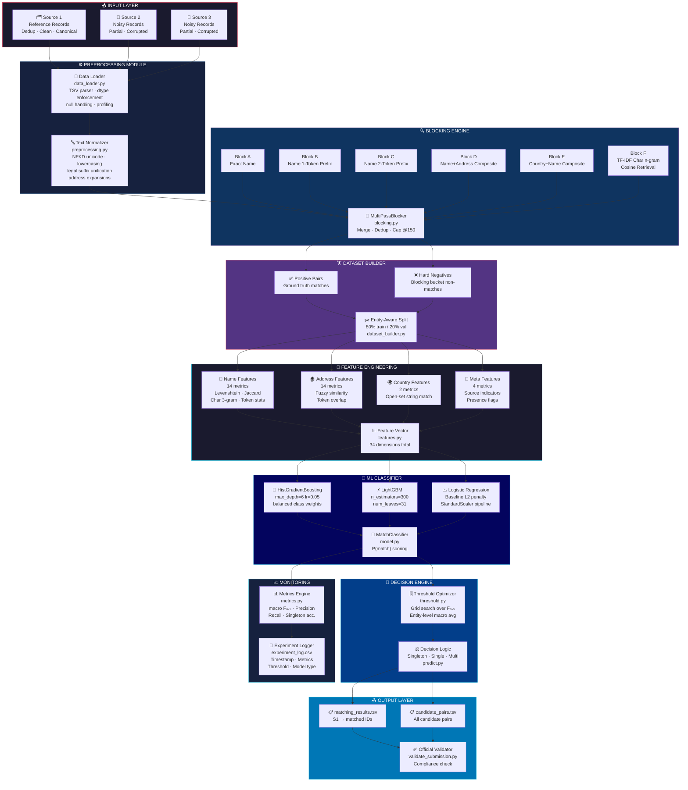

<div align="center">

<!-- ═══════════════════════════════════════════════════════════════════════ -->
<!--                          HERO BANNER                                   -->
<!-- ═══════════════════════════════════════════════════════════════════════ -->

```
╔══════════════════════════════════════════════════════════════════════════════╗
║                                                                              ║
║        ░█████╗░███╗░░░███╗░█████╗░███████╗░█████╗░███╗░░██╗                ║
║        ██╔══██╗████╗░████║██╔══██╗╚════██║██╔══██╗████╗░██║                ║
║        ███████║██╔████╔██║███████║░░███╔═╝██║░░██║██╔██╗██║                ║
║        ██╔══██║██║╚██╔╝██║██╔══██║██╔══╝░░██║░░██║██║╚████║                ║
║        ██║░░██║██║░╚═╝░██║██║░░██║███████╗╚█████╔╝██║░╚███║                ║
║        ╚═╝░░╚═╝╚═╝░░░░░╚═╝╚═╝░░╚═╝╚══════╝░╚════╝░╚═╝░░╚══╝                ║
║                                                                              ║
║             🤖  ML CHALLENGE 2026  •  BUSINESS ENTITY RESOLUTION  🏆        ║
║                                                                              ║
╚══════════════════════════════════════════════════════════════════════════════╝
```

<!-- ═══════════════════════════════════════════════════════════════════════ -->
<!--                         BADGE ROW 1 — Status                           -->
<!-- ═══════════════════════════════════════════════════════════════════════ -->

[](LICENSE)
[](https://www.python.org/)
[](https://www.amazon.science/)
[](utils/validate_submission.py)

<!-- ═══════════════════════════════════════════════════════════════════════ -->
<!--                         BADGE ROW 2 — Tech Stack                       -->
<!-- ═══════════════════════════════════════════════════════════════════════ -->

[](https://scikit-learn.org/)
[](https://lightgbm.readthedocs.io/)
[](https://pandas.pydata.org/)
[](https://numpy.org/)
[](https://github.com/maxbachmann/RapidFuzz)

<!-- ═══════════════════════════════════════════════════════════════════════ -->
<!--                         BADGE ROW 3 — Quality                          -->
<!-- ═══════════════════════════════════════════════════════════════════════ -->

[](tests/)
[](https://github.com/psf/black)
[](.github/workflows/ci.yml)
[](#)

---

### 🏅 *Production-grade • Competition-focused • End-to-End Pipeline*

**Identify matching business entities across noisy, multi-source data at scale.**

[📖 Docs](Documentation_template.md) &nbsp;•&nbsp; [🤝 Contributing](CONTRIBUTING.md) &nbsp;•&nbsp; [⚖️ License](LICENSE) &nbsp;•&nbsp; [📋 Code of Conduct](CODE_OF_CONDUCT.md)

</div>

---

## 🌐 Quick Navigation

| Section | Description |
|---------|-------------|
| [🎯 Problem Overview](#-problem-overview) | What this challenge is about |
| [🏗️ Architecture](#️-system-architecture) | System design & component diagram |
| [🔄 Pipeline Flow](#-pipeline-flow) | End-to-end data pipeline |
| [📦 Dataset](#-dataset-structure) | Data format & structure |
| [⚙️ Features](#️-feature-engineering) | 34-dimensional feature space |
| [🤖 Model](#-model--classifier) | ML classifier details |
| [📊 Metric](#-evaluation-metric) | F₀.₅ scoring explained |
| [🚀 Quick Start](#-quick-start) | Get running in 3 commands |
| [🗂️ Project Structure](#️-project-structure) | Full file tree |
| [👨‍💻 Author](#-author) | Creator info & links |

---

## 🎯 Problem Overview

> In large-scale commercial platforms, business identity data arrives from **multiple independent sources**, each contributing **partial, noisy fragments** about the same real-world entities.

### 📋 The Challenge

```
┌─────────────────────────────────────────────────────────────────────┐
│                     THREE-SOURCE RESOLUTION                         │
│                                                                     │
│  ┌──────────────┐    ┌──────────────┐    ┌──────────────┐          │
│  │   SOURCE 1   │    │   SOURCE 2   │    │   SOURCE 3   │          │
│  │  (Reference) │    │   (Noisy)    │    │   (Noisy)    │          │
│  │              │    │              │    │              │          │
│  │ • Deduplicated    │ • Partial    │    │ • Partial    │          │
│  │ • Clean       │   │ • Corrupted  │    │ • Corrupted  │          │
│  │ • Canonical   │   │ • Abbrev.    │    │ • Abbrev.    │          │
│  └──────┬───────┘    └──────┬───────┘    └──────┬───────┘          │
│         │                  │                   │                   │
│         └──────────────────┼───────────────────┘                   │
│                            ▼                                        │
│               ┌────────────────────────┐                           │
│               │   ENTITY RESOLUTION    │                           │
│               │  For each S1 entity,   │                           │
│               │  find all matches in   │                           │
│               │    S2 and S3           │                           │
│               └────────────────────────┘                           │
└─────────────────────────────────────────────────────────────────────┘
```

### 🎲 Match Cardinality

| Scenario | Description | Score Impact |
|----------|-------------|--------------|
| 🔵 Zero matches | Entity exists only in S1 (singleton) | F₀.₅ = 1.0 if correctly predicted |
| 🟢 One match | One corresponding record in S2 or S3 | Standard precision/recall |
| 🟡 Multiple matches | Same entity appears in both S2 and S3 | Full multi-match support |
| 🔴 False merge | Predicting match when none exists | F₀.₅ = 0.0 (hard penalty) |

> ⚠️ The system does **not** assume 1-to-1 matching and actively penalises false merges.

---
## 🏗️ System Architecture

> **Modern micromodule design** — each component is independently testable, swappable, and logged.



---

## 🔄 Pipeline Flow

> Step-by-step execution with digital component indicators.

```
 ╔══╗  STAGE 1 — INGESTION
 ║01║  📥 Load TSV files (sep="\t")  →  strict dtype enforcement  →  null profiling
 ╚══╝  └─ Modules: data_loader.py  |  Config: dataset/train|test/

 ╔══╗  STAGE 2 — NORMALIZATION
 ║02║  🔤 NFKD unicode decomposition  →  ASCII fold  →  lowercase  →  whitespace norm
 ╚══╝  →  Legal suffix unification  →  Address abbreviation expansion
       └─ Module: preprocessing.py

 ╔══╗  STAGE 3 — CANDIDATE GENERATION (BLOCKING)
 ║03║  🔍 6-pass blocking strategy:
 ╚══╝     [A] Exact name  [B] 1-token prefix  [C] 2-token prefix
          [D] Name+Address composite  [E] Country+Name composite
          [F] TF-IDF char n-gram cosine fallback (top-25, min sim=0.20)
       → Hard cap: 150 candidates per S1 entity
       → Bucket size limit: 500 (avoid uninformative giant buckets)
       └─ Module: blocking.py

 ╔══╗  STAGE 4 — DATASET CONSTRUCTION
 ║04║  🏋️ Entity-aware 80/20 train/val split (stratified by S1 entity)
 ╚══╝  → Positive pairs from ground truth  →  Hard negatives from blocking
       → Negative cap: 15× per positive  →  Prevent class imbalance collapse
       └─ Module: dataset_builder.py

 ╔══╗  STAGE 5 — FEATURE EXTRACTION
 ║05║  📐 34-dimensional feature vector per candidate pair:
 ╚══╝     • 14 Name features  (RapidFuzz + Jaccard + char 3-gram)
          • 14 Address features (same suite)
          • 2  Country features (open-set string compare)
          • 4  Meta features (source origin, presence flags)
       └─ Module: features.py

 ╔══╗  STAGE 6 — MODEL TRAINING
 ║06║  🤖 HistGradientBoostingClassifier (primary)
 ╚══╝     OR LightGBM  OR  LogisticRegression (baselines)
       → class_weight="balanced"  →  P(match) probability output
       └─ Module: model.py  |  Artifact: models/model.joblib

 ╔══╗  STAGE 7 — THRESHOLD OPTIMIZATION
 ║07║  📏 Grid search: [0.30 → 0.97] over validation set
 ╚══╝  → Maximise entity-level macro F₀.₅
       → Singleton rule enforced (empty pred on empty true = 1.0)
       └─ Module: threshold.py  |  Artifact: models/threshold.json

 ╔══╗  STAGE 8 — INFERENCE & OUTPUT
 ║08║  🚀 Apply trained model + optimal threshold on test set
 ╚══╝  → Generate matching_results.tsv  +  candidate_pairs.tsv
       → Run official competition validator
       └─ Modules: predict.py  output.py  |  Dir: output/

 ╔══╗  STAGE 9 — EXPERIMENT LOGGING
 ║09║  📈 Append run record: timestamp · model · threshold · F₀.₅
 ╚══╝  → Precision · Recall · Singleton accuracy · Pair counts
       └─ File: experiments/experiment_log.csv
```

---
## 📦 Dataset Structure

```
📁 dataset/
├── 📂 train/
│   ├── 📄 train_source1.tsv       ──▶  Reference records  (US 🇺🇸 · India 🇮🇳)
│   ├── 📄 train_source2.tsv       ──▶  Noisy target records
│   ├── 📄 train_source3.tsv       ──▶  Noisy target records
│   └── 📄 train_ground_truth.tsv  ──▶  S1 entity_id → matched_entity_ids
│
└── 📂 test/
    ├── 📄 test_source1.tsv        ──▶  Reference records  (US 🇺🇸 · India 🇮🇳 · France 🇫🇷)
    ├── 📄 test_source2.tsv        ──▶  Noisy target records
    └── 📄 test_source3.tsv        ──▶  Noisy target records
```

### 🗃️ Column Schema

| Column | Sources 1·2·3 | Ground Truth | Description |
|--------|:---:|:---:|-------------|
| `entity_id` | ✅ | ✅ | Unique identifier (e.g. `S1-001`, `S2-042`) |
| `business_name` | ✅ | ❌ | Raw business name string |
| `business_address` | ✅ | ❌ | Raw address string |
| `country` | ✅ | ❌ | Open-set country string |
| `source1_entity_id` | ❌ | ✅ | Reference entity (S1 side) |
| `matched_entity_ids` | ❌ | ✅ | Pipe-separated matched IDs |

### 🌍 Country Coverage

```
┌─────────────────────────────────────────────────────┐
│  TRAIN SET         TEST SET (extended)               │
│  🇺🇸  United States  🇺🇸 United States               │
│  🇮🇳  India          🇮🇳 India                       │
│                    🇫🇷 France  ← NEW (open-set)      │
│                                                      │
│  ⚠️  Country is treated as an open-set string.       │
│     Unseen countries pass through seamlessly.        │
└─────────────────────────────────────────────────────┘
```

---

## ⚙️ Feature Engineering

> **34-dimensional pairwise feature vector** computed for every candidate pair (S1, Target).

### 🔡 Name Features · 14 dimensions

| # | Feature | Type | Description |
|---|---------|------|-------------|
| 1 | `name_ratio` | float | Levenshtein edit distance ratio |
| 2 | `name_partial_ratio` | float | Best substring alignment score |
| 3 | `name_token_sort_ratio` | float | Sorted token comparison |
| 4 | `name_token_set_ratio` | float | Token set intersection ratio |
| 5 | `name_jaccard` | float | Token-level Jaccard similarity |
| 6 | `name_length_diff` | int | Absolute character length difference |
| 7 | `name_length_ratio` | float | min/max character length ratio |
| 8 | `name_token_count_diff` | int | Token count difference |
| 9 | `name_exact_match` | 0/1 | Exact normalized string match |
| 10 | `name_contains_other` | 0/1 | One name is substring of other |
| 11 | `same_first_name_token` | 0/1 | First tokens match |
| 12 | `shared_name_token_count` | int | Count of common tokens |
| 13 | `shared_name_token_ratio` | float | Shared tokens / max token count |
| 14 | `name_char3_jaccard` | float | Character 3-gram Jaccard |

### 🏠 Address Features · 14 dimensions
*Identical suite of 14 metrics applied to the address field.*

### 🌍 Country + Meta Features · 6 dimensions

| # | Feature | Description |
|---|---------|-------------|
| 29 | `country_exact_match` | 1 if both country strings match exactly |
| 30 | `country_missing` | 1 if either record has no country |
| 31 | `both_name_present` | 1 if both records have a non-empty name |
| 32 | `both_address_present` | 1 if both records have a non-empty address |
| 33 | `target_is_s2` | 1 if target record is from Source 2 |
| 34 | `target_is_s3` | 1 if target record is from Source 3 |

### 📊 Feature Space Breakdown

```
┌─────────────────────────────────────────────────────────────────────┐
│                   34-DIMENSIONAL FEATURE VECTOR                      │
│                                                                      │
│   NAME FEATURES          ADDRESS FEATURES        COUNTRY + META      │
│   ┌─────────────┐        ┌─────────────┐        ┌──────────────┐   │
│   │  dims 1-14  │        │  dims 15-28 │        │  dims 29-34  │   │
│   │             │        │             │        │              │   │
│   │ Levenshtein │        │ Levenshtein │        │ Country      │   │
│   │ Partial     │        │ Partial     │        │ exact match  │   │
│   │ Token Sort  │        │ Token Sort  │        │ Country      │   │
│   │ Token Set   │        │ Token Set   │        │ missing      │   │
│   │ Jaccard     │        │ Jaccard     │        │ Presence     │   │
│   │ Char 3-gram │        │ Char 3-gram │        │ flags        │   │
│   │ + 8 more    │        │ + 8 more    │        │ Source IDs   │   │
│   └─────────────┘        └─────────────┘        └──────────────┘   │
│        41%                    41%                    18%             │
└─────────────────────────────────────────────────────────────────────┘
```

---

## 🤖 Model & Classifier

### 🌲 Primary — HistGradientBoostingClassifier

```python
HistGradientBoostingClassifier(
    max_iter       = 250,
    max_depth      = 6,
    min_samples_leaf = 20,
    learning_rate  = 0.05,
    class_weight   = "balanced",   # handles class imbalance
    random_state   = 42,
)
```

### ⚡ Alternative — LightGBM

```python
LGBMClassifier(
    n_estimators  = 300,
    max_depth     = 6,
    num_leaves    = 31,
    learning_rate = 0.05,
    class_weight  = "balanced",
    n_jobs        = -1,
)
```

### 📉 Baseline — Logistic Regression

```python
Pipeline([
    ("scaler", StandardScaler()),
    ("clf", LogisticRegression(C=1.0, class_weight="balanced", max_iter=1000)),
])
```

### 🔄 Model Selection Comparison

| Model | Strengths | Best For |
|-------|-----------|----------|
| 🌲 **HistGBM** *(default)* | Fast, native NaN support, balanced weights | Primary competition submission |
| ⚡ **LightGBM** | High accuracy, histogram-based splits | When tuning for leaderboard gain |
| 📉 **LogReg** | Interpretable, fast training | Baseline validation & debugging |

---

## 📊 Evaluation Metric

### 🏆 Entity-Level Macro F₀.₅

> **Precision is weighted 4× more than recall** — the competition penalises false positives heavily.

$$F_{0.5} = \frac{(1 + 0.5^2) \times \text{Precision} \times \text{Recall}}{0.5^2 \times \text{Precision} + \text{Recall}} = \frac{1.25 \times P \times R}{0.25 \times P + R}$$

```
┌────────────────────────────────────────────────────────────────────┐
│                     SCORING DECISION TABLE                          │
│                                                                     │
│  True Set    Predicted Set    Entity Score    Explanation           │
│  ─────────────────────────────────────────────────────────────     │
│  ∅  (empty)  ∅  (empty)       1.000  ✅       Correct singleton    │
│  ∅  (empty)  {S2-001}         0.000  ❌       False merge penalty  │
│  {S2-001}    {S2-001}         1.000  ✅       Perfect match        │
│  {S2-001}    {S2-001,S3-005}  ~0.714 ⚠️       Extra false positive │
│  {S2-001}    ∅  (empty)       0.000  ❌       Missed match         │
│                                                                     │
│  Final score = macro average across ALL Source 1 entities           │
└────────────────────────────────────────────────────────────────────┘
```

### 🎚️ Threshold Optimization Grid

```
Threshold search range:  0.30 ──────────────────────────────▶ 0.97
                         [0.30, 0.40, 0.50, 0.55, 0.60, 0.65,
                          0.70, 0.75, 0.80, 0.82, 0.85, 0.88,
                          0.90, 0.92, 0.94, 0.95, 0.97]

Objective:  argmax F₀.₅  over entity-level macro validation score
Default:    0.75  (pre-optimization fallback)
```

---
## 🚀 Quick Start

### 📋 Prerequisites

```
┌────────────────────────────────────────────┐
│  ✅  Python  3.10 / 3.11 / 3.12            │
│  ✅  pip  ≥ 23.0                           │
│  ✅  8 GB RAM  (recommended)               │
│  ✅  Dataset files in  dataset/            │
└────────────────────────────────────────────┘
```

### ⚡ 3-Step Setup

```bash
# 1️⃣  Clone the repository
git clone https://github.com/sunbyte16/amazon-ml-challenge-2026.git
cd amazon-ml-challenge-2026

# 2️⃣  Install all dependencies
pip install -r requirements.txt

# 3️⃣  Run the full end-to-end pipeline
python -m business_entity_resolution.pipeline --mode all
```

---

## 🎮 Usage Guide

### 🔬 Mode 1 · Exploratory Data Analysis

```bash
python -m business_entity_resolution.pipeline --mode eda
```
```
📊 Output:  Dataset profiles, null counts, country distributions,
            ground truth match cardinality stats
```

### 🏋️ Mode 2 · Train Classifier

```bash
# Default model (HistGradientBoosting)
python -m business_entity_resolution.pipeline --mode train

# Choose specific model
python -m business_entity_resolution.pipeline --mode train --model lightgbm
python -m business_entity_resolution.pipeline --mode train --model logistic_regression
```
```
📦 Artifacts saved:
    models/model.joblib          ← trained classifier
    models/threshold.json        ← optimal decision threshold
    models/feature_metadata.json ← feature names & config
    experiments/experiment_log.csv ← run metrics log
```

### 🔮 Mode 3 · Predict on Test Set

```bash
# Use saved model + optimal threshold
python -m business_entity_resolution.pipeline --mode predict

# Override threshold manually
python -m business_entity_resolution.pipeline --mode predict --threshold 0.80
```
```
📋 Output files:
    output/matching_results.tsv   ← official submission file
    output/candidate_pairs.tsv    ← candidate pairs for review
```

### ✅ Mode 4 · Validate Submission

```bash
python -m business_entity_resolution.pipeline --mode validate

# Or run the validator directly
python utils/validate_submission.py \
    --matching  output/matching_results.tsv \
    --candidate output/candidate_pairs.tsv \
    --test-dir  dataset/test
```

### 🔁 Mode 5 · Full Pipeline (EDA → Train → Predict → Validate)

```bash
python -m business_entity_resolution.pipeline --mode all
```

### 🧪 Run Unit Tests

```bash
pytest tests/ -v
```
```
Expected:  11/11 tests passing  ✅
```

---

## 🗂️ Project Structure

```
📁 amazon-ml-challenge-2026/
│
├── 📁 .github/
│   └── 📁 workflows/
│       └── 📄 ci.yml                    ← GitHub Actions CI/CD
│
├── 📁 dataset/
│   ├── 📁 train/
│   │   ├── 📄 train_source1.tsv         ← Reference records
│   │   ├── 📄 train_source2.tsv         ← Noisy target records
│   │   ├── 📄 train_source3.tsv         ← Noisy target records
│   │   └── 📄 train_ground_truth.tsv    ← Match labels
│   └── 📁 test/
│       ├── 📄 test_source1.tsv
│       ├── 📄 test_source2.tsv
│       └── 📄 test_source3.tsv
│
├── 📁 src/
│   └── 📁 business_entity_resolution/   ← Main Python package
│       ├── 🐍 __init__.py
│       ├── 🐍 config.py                 ← Centralized config dataclass
│       ├── 🐍 data_loader.py            ← TSV ingestion & profiling
│       ├── 🐍 preprocessing.py          ← Text normalization
│       ├── 🐍 blocking.py               ← 6-pass candidate generation
│       ├── 🐍 dataset_builder.py        ← Pair construction & train/val split
│       ├── 🐍 features.py               ← 34-dim feature engineering
│       ├── 🐍 model.py                  ← ML classifier wrappers
│       ├── 🐍 threshold.py              ← F₀.₅ threshold optimizer
│       ├── 🐍 metrics.py                ← Entity-level macro F₀.₅
│       ├── 🐍 predict.py                ← Test set inference
│       ├── 🐍 output.py                 ← TSV output generator
│       └── 🐍 pipeline.py               ← Master CLI orchestrator
│
├── 📁 models/
│   ├── 📄 model.joblib                  ← Trained classifier artifact
│   ├── 📄 threshold.json                ← Optimal decision threshold
│   └── 📄 feature_metadata.json         ← Feature names & config
│
├── 📁 output/
│   ├── 📄 matching_results.tsv          ← 🏆 Official submission file
│   └── 📄 candidate_pairs.tsv           ← Candidate pairs
│
├── 📁 experiments/
│   └── 📄 experiment_log.csv            ← Run history & metrics
│
├── 📁 notebooks/
│   ├── 📓 01_eda.ipynb
│   ├── 📓 02_preprocessing.ipynb
│   ├── 📓 03_blocking.ipynb
│   ├── 📓 04_features.ipynb
│   └── 📓 05_model.ipynb
│
├── 📁 tests/                            ← Unit tests (11/11 passing)
├── 📁 utils/
│   └── 🐍 validate_submission.py        ← Official competition validator
│
├── 📄 requirements.txt
├── 📄 pyproject.toml
├── 📄 Documentation_template.md
├── 📄 CONTRIBUTING.md
├── 📄 CODE_OF_CONDUCT.md
└── 📄 LICENSE
```

---

## 📦 Submission Package

```
📦 <team_name>_submission.zip
├── 📁 output/
│   ├── 📄 matching_results.tsv     ← Evaluated on leaderboard
│   └── 📄 candidate_pairs.tsv
├── 📁 code/
│   └── 📁 business_entity_resolution/
│       ├── 📁 src/
│       ├── 📁 tests/
│       ├── 📁 utils/
│       ├── 📄 requirements.txt
│       └── 📄 README.md
└── 📄 Documentation_template.md    ← Detailed methodology document
```

---

## 🛠️ Tech Stack

<div align="center">

| Layer | Technology | Purpose |
|-------|-----------|---------|
| 🐍 **Language** | Python 3.10+ | Core implementation |
| 📊 **Data** | Pandas · NumPy | Data wrangling & arrays |
| 🔤 **String Matching** | RapidFuzz | Fast Levenshtein & fuzzy metrics |
| 🌲 **ML Primary** | scikit-learn HistGBM | Main match classifier |
| ⚡ **ML Alternative** | LightGBM | High-performance gradient boosting |
| 🔍 **Retrieval** | TF-IDF (sklearn) | Char n-gram cosine blocking |
| 📈 **Visualization** | Matplotlib · Seaborn | EDA charts |
| 💾 **Persistence** | Joblib | Model serialization |
| 🧪 **Testing** | Pytest | Unit test suite |
| ⚙️ **CI/CD** | GitHub Actions | Automated test runs |

</div>

---

## 🤝 Contributing

Contributions, issues and feature requests are welcome!

1. 🍴 Fork the repository
2. 🌿 Create a feature branch: `git checkout -b feature/amazing-feature`
3. 💾 Commit your changes: `git commit -m 'Add amazing feature'`
4. 📤 Push to the branch: `git push origin feature/amazing-feature`
5. 🔁 Open a Pull Request

Please read [CONTRIBUTING.md](CONTRIBUTING.md) and [CODE_OF_CONDUCT.md](CODE_OF_CONDUCT.md) before contributing.

---

## 📄 License

Distributed under the **MIT License**. See [`LICENSE`](LICENSE) for more information.

---

<div align="center">

## 👨‍💻 Author

```
╔═══════════════════════════════════════════════════════╗
║                                                       ║
║    Created By  𝕊𝕦𝕟𝕚𝕝 𝕊𝕙𝕒𝕣𝕞𝕒  ❤️                   ║
║                                                       ║
╚═══════════════════════════════════════════════════════╝
```

[](https://github.com/sunbyte16)
[](https://www.linkedin.com/in/sunil-kumar-bb88bb31a/)
[](https://lively-dodol-cc397c.netlify.app)

---

### ⭐ If this project helped you, please give it a star!

```
★ ★ ★ ★ ★
```

---

*Built with ❤️ for the Amazon ML Challenge 2026*


</div>
#
